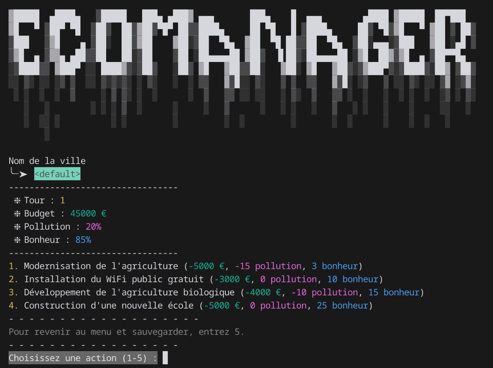

<br/>
<p align="center">
    <picture>
        <source media="(prefers-color-scheme: dark)" srcset="https://github.com/yannouuuu/IUT-SAE1.01/raw/main/.github/assets/header_univlille_light.png" width="200px">
        
    </picture>
  <h1 align="center">IUT-SAE1.02 | EcoManager</h1>
</p>

<p align="center">
    Module d'initiation au développement iJava simple en BUT1 d'Informatique
    <br/>
    Comparaison d’approches algorithmiques
    - Logiciels Ludo-pédagogiques
    <br/>
    <br/>
    <a href="https://moodle.univ-lille.fr/course/view.php?id=30388&sectionid=262713"><strong>Voir la page sur le moodle »</strong></a>
    <br/>
    <br/>
    <a href="https://github.com/yannouuuu/IUT-SAE1.02/"><strong>Voir le projet complet sur GitHub »</strong></a>
</p>

<br/>

## Description du projet

**EcoManager** est un jeu ludo-pédagogique conçu pour initier à la gestion durable d'une ville. 
Le joueur incarne le maire d’une petite cité et prend des décisions impactant le **budget**, la **pollution** et le **bonheur des citoyens**.  
L’objectif : équilibrer ces trois paramètres pour construire une ville prospère tout en respectant l’environnement.  
Ce projet s'inscrit dans le cadre de la SAE 1.02 du BUT Informatique et vise à comparer des approches algorithmiques tout en développant une application interactive.

## Fonctionnalités : To-Do List

### **À faire absolument (version minimale) :**
- [x] **Mode texte uniquement** pour le jeu.  
- [ ] Contrôle robuste de saisie pour éviter les erreurs/crashs.  
- [x] Présentation de choix simples :  
  - [x] Construire une usine.  
  - [x] Planter des arbres.  
  - [x] Organiser un festival (ou autre action sociale).  
- [x] Gestion des ressources principales :  
  - [x] Argent (budget).  
  - [x] Pollution.  
  - [x] Satisfaction des citoyens (bonheur).  
- [x] Affichage clair de l’état de la ville après chaque tour :  
  - [x] Argent.  
  - [x] Pollution.  
  - [x] Population heureuse.  
- [x] Détection des fins possibles :  
  - [x] Victoire (budget positif, pollution maîtrisée <50%, citoyens heureux >70%).  
  - [x] Défaite (pollution >100%, argent à 0, bonheur <50%).  

### **Envisagé (fonctionnalités bonus si le temps le permet) :**
- [x] **Plus de types de décisions :**  
  - [x] Subventionner les transports en commun.  
  - [x] Taxer les industries.  
  - [x] Actions spécifiques selon le contexte.  
- [ ] **Système d’événements aléatoires :**  
  - [ ] Grèves.  
  - [ ] Inondations.  
  - [ ] Manifestations écologistes.  
- [ ] Sauvegarde et chargement de la partie.  

### **Ambitieux (difficile à réaliser dans le délai) :**
- [ ] **Mode graphique basique** : carte ASCII représentant les zones de la ville.  
- [ ] Système de **"conseillers"** :  
  - [ ] Conseiller économique.  
  - [ ] Conseiller écologiste.  
  - [ ] Citoyens avec opinions variables.  
- [ ] **Mode comparaison des joueurs :**  
  - [ ] Comparaison des performances (scores ou villes).  
- [ ] Simulation avancée avec :  
  - [ ] Bâtiments spécifiques (écoles, hôpitaux, industries, etc.).  
  - [ ] Gestion des zones urbaines.  

## Environnement de développement

- **Langage :** Java, Ijava
- **Outils :**
  - IDE/Text Editor : IntelliJ IDEA, VS Code ou NeoVim
  - Git pour la gestion de version
- **Configuration minimale :**
  - JDK 11 ou supérieur

## Installation et Configuration

### 1. Prérequis
- **Java Development Kit (JDK)** version 11 ou supérieure.
- **Git** pour cloner le dépôt.

### 2. Étapes d'installation
```bash
# Cloner le dépôt
git clone https://github.com/yannouuuu/IUT-SAE1.02/

# Accéder au répertoire
cd IUT-SAE1.02/
```
3. Compilation et Exécution
```bash
# Compilation
./compile.sh

# Exécution
./run.sh
```

## Guide d'utilisation
1. *Lancer le jeu* : Exécutez la commande ```./run.sh``` après compilation.
2. *Menu principal* : Choisissez entre une nouvelle partie, charger une sauvegarde ou quitter.
3. *Tour de jeu* : Prenez des décisions via les options proposées (ex. : construire une usine, planter des arbres). // Observez les impacts sur les trois variables principales (Budget, Pollution, Bonheur).
4. *Fin de partie* : Atteignez la victoire en maintenant un équilibre après 30 tours ou évitez les conditions de défaite.

## Exemple de gameplay
{: style="border-radius: 15px;" }

## Structure des fichiers
```plaintext
IUT-SAE1.02/
├── .github/
│   ├── assets/                   
│   └── workflows/
│       └── gitlab-sync.yml       # Workflow GHA pour la synchronisation avec GitLab 
├── .gitignore                    # Fichier gitignore
├── .gitlab/
│   └── assets/                   # Ressources pour GitLab
├── .vscode/
│   ├── extensions.json           # Configuration des extensions VSCode
│   ├── launch.json               # Configuration de lancement VSCode
│   └── settings.json             # Configuration des paramètres VSCode
├── classes/
│   ├── App.class                 
│   ├── City.class                
│   └── Decisions.class           
├── compile.bat                   # Script batch pour compiler le projet sous Windows
├── compile.sh                    # Script shell pour compiler le projet sous Linux
├── docs/
│   └── trace_exec.mdx            # Fichier de documentation
├── lib/
│   └── program.jar               
├── LICENSE                       
├── README.md                     
├── ressources/
│   ├── configuration.csv         # Données de configuration
│   ├── decisions.csv             # Données de décisions
│   ├── evenements.csv            # Données d'événements
│   ├── lose.txt                  # Message de défaite
│   ├── rules.txt                 # Règles du jeu
│   ├── save.csv                  # Fichier de sauvegarde
│   ├── titre_ascii.txt           # ASCII Art du titre
│   └── win.txt                   # Message de victoire
├── run.bat                       # Script batch pour exécuter le projet sous Windows
├── run.sh                        # Script shell pour exécuter le projet sous Linux
├── src/
│   ├── App.java                  # Code source de la classe App
│   ├── City.java                 # Code source de la classe City
│   ├── Decisions.java            # Code source de la classe Decisions
│   └── Evenements.java           # Code source de la classe Evenements
```

## Captures d'écran
Des exemples visuels du fonctionnement du jeu sont disponibles dans le répertoire [shots](./shots).

## Développé avec 💖 par
- Yann RENARD
  > yann.renard.etu@univ-lille.fr
- Yanis MEKKI
  > yanis.mekki.etu@univ-lille.fr

---

### Remerciements

Nous tenons à créditer **SECQ Yann et ABIDI Sofiene, ALMEIDA COCO Amadeu, BONEVA Iovka, CASTILLON
Antoine, DELECROIX Fabien, LEPRETRE Éric, SANTANA MAIA Deise** pour la création des diaporamas de cours, des TP, TD et pour la réalisation des SAE. Leur travail a été précieux pour notre apprentissage.

<br/>
<p align="center">
    <picture>
        
    </picture>
</p>
